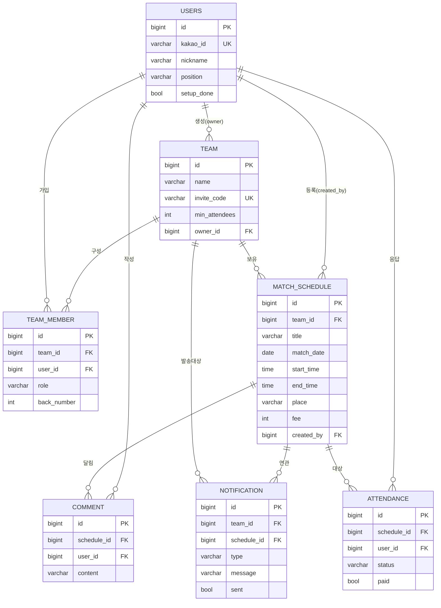

# matchon ERD

## 관계 다이어그램 (Mermaid)

## 관계 요약

| 관계 | 카디널리티 | 설명 |
|------|-----------|------|
| USERS ─ TEAM_MEMBER ─ TEAM | M:N | 한 유저는 여러 팀, 한 팀은 여러 유저 (교차 엔티티 TEAM_MEMBER, role 포함) |
| TEAM ─ MATCH_SCHEDULE | 1:N | 팀의 경기 일정들 |
| MATCH_SCHEDULE ─ ATTENDANCE | 1:N | 일정별 참석 응답 (유저당 1행, unique) |
| MATCH_SCHEDULE ─ COMMENT | 1:N | 일정 댓글 |
| TEAM/SCHEDULE ─ NOTIFICATION | 1:N | 알림 이력 |

## 핵심 제약(Unique)
- `users.kakao_id` UNIQUE — 카카오 1계정 1유저
- `team.invite_code` UNIQUE — 초대코드 충돌 방지
- `team_member(team_id, user_id)` UNIQUE — 중복 가입 방지
- `attendance(schedule_id, user_id)` UNIQUE — 1인 1응답
- `notification(schedule_id, type)` — 동일 일정·동일 타입 알림 1회만(중복 발송 방지)

상세 컬럼/인덱스는 [04_DB설계서.md](./04_DB설계서.md) 참고.
